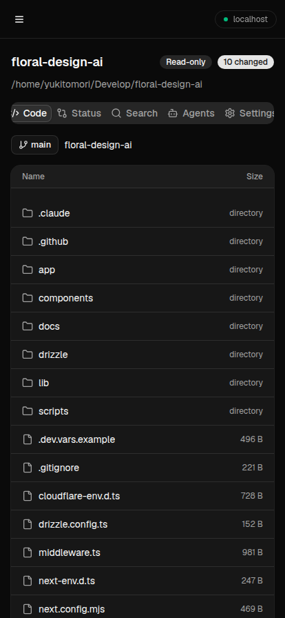
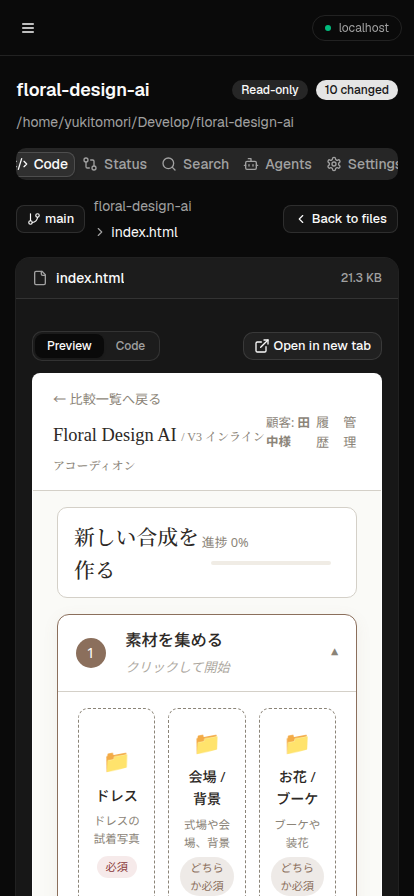

# Pocket Repo

[](https://www.npmjs.com/package/pocket-repo)
[](https://github.com/yuki7070/pocket-repo/actions/workflows/ci.yml)
[](LICENSE)

A local, **read-only** Git repository viewer built for mobile browsers. Run it
on your machine and browse your repositories — files, diffs, branches,
worktrees, and running coding-agent sessions — from your phone or any browser
on the same network.

Pocket Repo never edits files or mutates Git state. It only reads.

```bash
npx pocket-repo
```

| File browser | HTML preview |
| :---: | :---: |
|  |  |

## Features

- **File browser** — navigate directories and open files, GitHub-style. Opening
  a file switches to a dedicated file view with a breadcrumb path.
- **Image & Markdown rendering** — images render inline, Markdown renders with
  embedded images and working relative links.
- **HTML preview** — HTML files open as a rendered preview in a sandboxed
  iframe by default, with a Preview/Code toggle for the source and a button to
  open the rendered page in a new tab. Relative assets (CSS, JS, fonts, images)
  resolve against the repository.
- **Marp slides** — Markdown decks (`marp: true`) render as slides, with a
  fullscreen slideshow and a Slides/Markdown/Code toggle.
- **PDF preview** — `.pdf` files render inline in a viewer, with a button to
  open them in a new tab. No extra tooling required.
- **Office document preview** *(optional)* — presentations (`.pptx` / `.ppt` /
  `.odp`), documents (`.docx` / `.doc` / `.odt` / `.rtf`), and spreadsheets
  (`.xlsx` / `.xls` / `.ods`) are previewed as PDF when
  [LibreOffice](https://www.libreoffice.org/) is installed (e.g.
  `sudo apt install libreoffice`). Conversions are cached; the original file is
  never modified.
- **Status & branch diff** — see uncommitted working-tree changes, or compare
  the current branch against another branch (e.g. `develop`) to list the files
  that differ.
- **File search** — quickly find files by name across the repository.
- **Worktree switching** — switch between a repository's linked worktrees; file
  listings, diffs, and search follow the selected worktree.
- **Grouped recent repositories** — recent repositories are grouped by their
  underlying repo, with collapsible groups for their worktrees.
- **Agents dashboard** — see which Claude Code and Codex sessions are running and
  which worktree each is working in, both globally and per repository. Each
  session shows its title and links straight to the matching
  [claude.ai/code](https://claude.ai/code) session so you can jump in from your
  phone.
- **Remote control** *(opt-in)* — from a repository's Agents tab, launch a
  `claude remote-control` server (spawn mode, capacity, permission mode) so you
  can drive Claude Code sessions from [claude.ai/code](https://claude.ai/code)
  or the Claude mobile app. This is the one action that can start
  write-capable sessions; the viewer itself stays read-only. To start the
  server, Pocket Repo marks the workspace as trusted by writing
  `hasTrustDialogAccepted` for that path in `~/.claude.json` (the only file it
  ever writes).

## Tech stack

- [Next.js 15](https://nextjs.org/) (App Router) + React 19
- [shadcn/ui](https://ui.shadcn.com/) on Tailwind CSS v4 (Base UI primitives)
- [Hono](https://hono.dev/) for the API routes
- `react-markdown` + `remark-gfm` for Markdown rendering

## Quick start

Requirements: Node.js 20+. No install or clone needed — run it directly with
[`npx`](https://docs.npmjs.com/cli/commands/npx):

```bash
npx pocket-repo
```

This starts the server on `0.0.0.0:4545`. Open `http://<your-machine-ip>:4545`
from your phone or any device on the same network, then point Pocket Repo at a
local Git repository to start browsing.

### Options

```bash
npx pocket-repo --port 8080       # listen on a different port (default: 4545)
npx pocket-repo --host 127.0.0.1  # bind to a specific host (default: 0.0.0.0)
npx pocket-repo --help
```

| Option              | Default   | Description            |
| ------------------- | --------- | ---------------------- |
| `-p`, `--port`      | `4545`    | Port to listen on      |
| `-H`, `--host`      | `0.0.0.0` | Host to bind to        |
| `-h`, `--help`      | —         | Show usage             |

> Tip: binding to `0.0.0.0` (the default) makes the server reachable from other
> devices on your network. Find your machine's IP with `ipconfig getifaddr en0`
> (macOS) or `hostname -I` (Linux).

### Install as an app (PWA)

Pocket Repo is a Progressive Web App, so you can install it to your home screen
or desktop (its own window, app icon, no browser chrome).

- **Desktop / localhost** — open it in Chrome/Edge and use the install icon in
  the address bar.
- **Phone** — installing requires a **secure context**, so a plain
  `http://<lan-ip>:4545` address won't offer install. Reach it over HTTPS — for
  example via a tunnel (`cloudflared`, `ngrok`) or a reverse proxy with TLS —
  then use "Add to Home Screen". The app itself works fine over plain HTTP; only
  the install prompt needs HTTPS.

### Run as a service (systemd --user)

To keep Pocket Repo running in the background on Linux, install it globally and
use the bundled [`docs/pocket-repo.service`](docs/pocket-repo.service) template:

```bash
npm install -g pocket-repo
mkdir -p ~/.config/systemd/user
cp docs/pocket-repo.service ~/.config/systemd/user/pocket-repo.service
# edit ExecStart in the file to match your Node/pocket-repo paths
#   (find them with: command -v node ; command -v pocket-repo)
systemctl --user daemon-reload
systemctl --user enable --now pocket-repo
```

Useful commands:

```bash
systemctl --user status pocket-repo     # check it's running
journalctl --user -u pocket-repo -f     # follow the logs
loginctl enable-linger "$USER"          # optional: keep running while logged out
```

## Run from source

To hack on Pocket Repo, clone the repo and use [pnpm](https://pnpm.io/):

```bash
pnpm install

# Development
pnpm dev                                  # dev server on http://localhost:3000

# Production
pnpm build
pnpm exec next start -H 0.0.0.0 -p 4545   # serve on your network
```

### Scripts

| Script           | Description                     |
| ---------------- | ------------------------------- |
| `pnpm dev`       | Start the dev server            |
| `pnpm build`     | Production build                |
| `pnpm start`     | Start the production server     |
| `pnpm lint`      | Run ESLint                      |
| `pnpm typecheck` | Type-check with `tsc --noEmit`  |

## How it works

Pocket Repo keeps a small list of recently opened repositories under
`~/.pocket-repo/`. Repository contents are read directly from disk and through
read-only `git` commands (`status`, `diff`, `branch`, `worktree list`, …). The
Agents dashboard reads Claude Code session metadata from `~/.claude/sessions`
and Codex session metadata from `~/.codex/sessions` to show which agents are
active and where.

Because everything is local and read-only, no credentials, remotes, or write
access are required.

## License

Released under the [MIT License](LICENSE).
